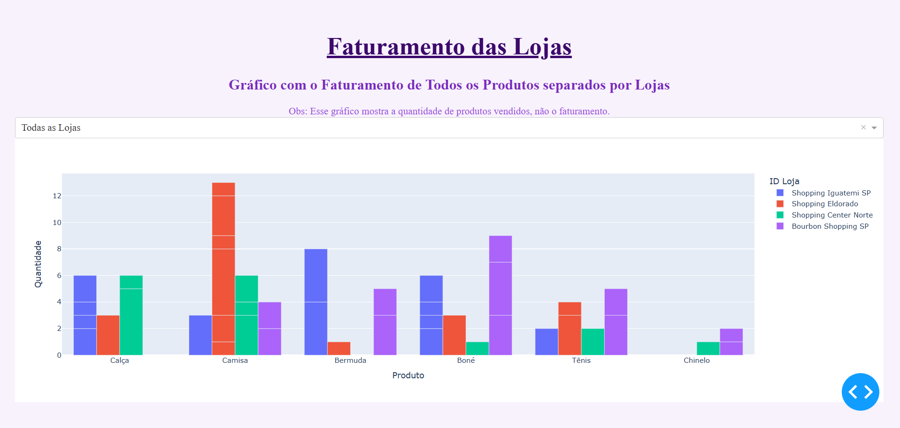

# Dashboard-em-Python 👩🏻‍💻
Neste projeto, desenvolvi um dashboard utilizando as bibliotecas Dash e Ploty em Python, focando na criação de gráficos interativos. A biblioteca Ploty é uma ferramenta poderosa para visualização de dados, permitindo a construção de gráficos dinâmicos e informativos. O Dash, por sua vez, é uma extensão do Ploty que possibilita a criação de aplicações web interativas, onde gráficos podem interagir com diversos componentes, como botões, caixas de seleção e listas de valores.

# Sobre o Projeto 📑
Com esse projeto de Dashboard com Python, poderemos verificar a quantidade de produtos vendidos, com o foco na criação de gráficos dinâmicos que permitem a interação do usuário.

# Como Funciona 🎯

  <ul>
    <li>O usuário terá acesso ao dashboard via navegador, após execução do código no VSCode.
    <li>Integração com dados em Excel, permitindo a leitura e manipulação de informações diretamente de planilhas. 
    <li>No gráfico encontrará informações sobre o faturamento das lojas, tem a opção de visualizar e analisar loja por loja.
    <li>Além disso, a aplicação pode ter recursos adicionais, filtrar as informações, como também permitir analises mais detalhada.      
    </li>  
  </ul>

# Tecnologias 🛠️
As seguintes ferramentas que foram utilizadas na construção do projeto:
<table>
  <thead>
    <th>Backend</th>
  </thead>
  <tbody>
    <tr>
      <td>Python</td>
    </tr>
    <tr>
      <td>Dash</td>
    </tr>
    <tr>
      <td>Ploty</td>
    </tr>
  </tbody>
</table>
